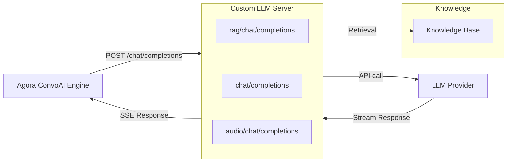

#  Custom LLM Server

OpenAI-compatible LLM proxy for Agora Conversational AI with streaming, tools, and RAG.

- [Overview](#overview)
- [Quick Start](#quick-start)
- [Architecture](#architecture)
- [Endpoints](#endpoints)
- [Integration](#integration)
- [Resources](#resources)
- [License](#license)

## Overview

The Custom LLM Server sits between the Agora Conversational AI Engine and your
LLM provider, giving you full control over the request/response pipeline. Use it
to inject RAG context, transform messages, add custom tools, or route to
different models.

All implementations provide the same three OpenAI-compatible streaming endpoints
so you can drop in any language and get the same behavior.

## Quick Start

| Language | Framework | Endpoints | Guide |
|----------|-----------|-----------|-------|
| Python | FastAPI + uvicorn | `/chat/completions`, `/rag/chat/completions`, `/audio/chat/completions` | [python/](./python/) |
| Node.js | Express | `/chat/completions`, `/rag/chat/completions`, `/audio/chat/completions` | [node/](./node/) |
| Go | Gin | `/chat/completions`, `/rag/chat/completions`, `/audio/chat/completions` | [go/](./go/) |

## Architecture



The Custom LLM approach gives you a server you control that the Agora ConvoAI
Engine calls instead of calling the LLM provider directly. Your server can:

- Modify prompts and messages before forwarding to the LLM
- Inject RAG context from your own knowledge base
- Add or transform tool definitions
- Route to different models based on request context
- Return multimodal audio responses

## Endpoints

### `/chat/completions` — Basic LLM Proxy

Receives an OpenAI-compatible chat completion request, forwards it to the LLM
provider with streaming enabled, and relays the SSE chunks back to the caller.

This is the baseline endpoint — use it as-is or as a starting point for
customization.

### `/rag/chat/completions` — RAG-Enhanced

Same as the basic endpoint but with a retrieval step before the LLM call:

1. Sends a "thinking" message to keep the connection alive
2. Performs RAG retrieval against your knowledge base
3. Injects the retrieved context into the message list
4. Forwards the augmented messages to the LLM

Customize `perform_rag_retrieval()` and `refact_messages()` with your own
retrieval logic.

### `/audio/chat/completions` — Multimodal Audio

Returns audio responses with transcript. Reads a text file for the transcript
and a PCM file for the audio data, then streams them as SSE chunks. Use this as
a reference for implementing custom audio responses.

## Integration

To use a Custom LLM Server with Agora Conversational AI:

1. Start your server and expose it via a tunnel:

```bash
cd python
python3 custom_llm.py
cloudflared tunnel --url http://localhost:8000
```

2. Configure the Agora ConvoAI agent to use your custom LLM endpoint in the
   agent start API call:

```json
{
  "llm": {
    "url": "https://your-tunnel.trycloudflare.com/chat/completions",
    "api_key": "your-llm-api-key",
    "model": "gpt-4o-mini"
  }
}
```

## Resources

- [Agora Conversational AI Docs](https://docs.agora.io/en/conversational-ai/overview) — ConvoAI Engine documentation
- [Agora Console](https://console.agora.io/) — Get your App ID and credentials
- [OpenAI Chat Completions API](https://platform.openai.com/docs/api-reference/chat) — API reference for the compatible format

## License

This project is licensed under the MIT License. See [LICENSE](./LICENSE).
