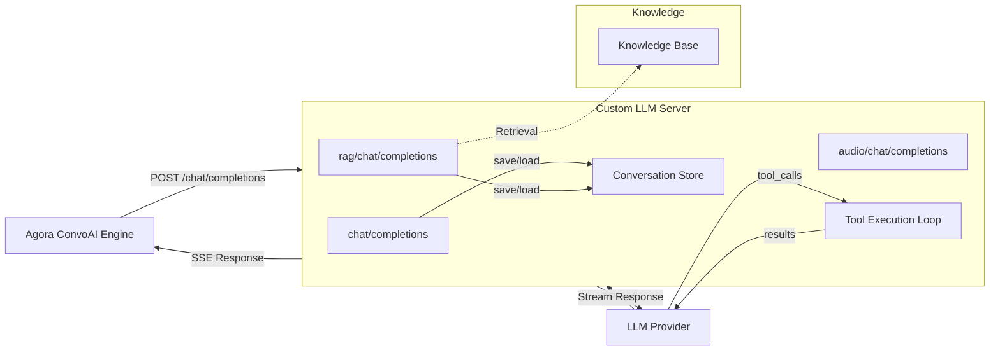
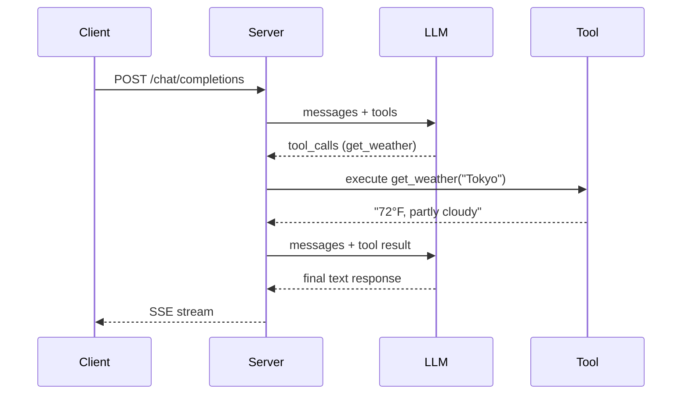

#  Custom LLM Server

OpenAI-compatible LLM proxy for Agora Conversational AI with streaming, tool execution, conversation memory, and RAG.

- [Overview](#overview)
- [Features](#features)
- [Quick Start](#quick-start)
- [Architecture](#architecture)
- [Endpoints](#endpoints)
- [Environment Variables](#environment-variables)
- [Tool Execution](#tool-execution)
- [Conversation Memory](#conversation-memory)
- [RTM Integration](#rtm-integration)
- [Ports](#ports)
- [Expose Locally](#expose-locally)
- [Testing](#testing)
- [Integration](#integration)
- [Resources](#resources)
- [License](#license)

## Overview

The Custom LLM Server sits between the Agora Conversational AI Engine and your
LLM provider, giving you full control over the request/response pipeline. Use it
to execute tools server-side, maintain conversation history, inject RAG context,
transform messages, or route to different models.

All implementations provide the same OpenAI-compatible endpoints so you can drop
in any language and get the same behavior.

## Features

| Feature | Python | Node.js | Go |
|---------|--------|---------|-----|
| Streaming chat completions | Yes | Yes | Yes |
| Non-streaming chat completions | Yes | Yes | Yes |
| Server-side tool execution (multi-pass) | Yes | Yes | Yes |
| Conversation memory (per-channel) | Yes | Yes | Yes |
| RAG retrieval (keyword-based) | Yes | Yes | Yes |
| Multimodal audio responses | Yes | Yes | Yes |
| RTM text messaging | -- | Yes | -- |

## Quick Start

| Language | Framework | Guide |
|----------|-----------|-------|
| Python | FastAPI + uvicorn | [python/](./python/) |
| Node.js | Express | [node/](./node/) |
| Go | Gin | [go/](./go/) |

## Architecture



### Tool Execution Flow



## Endpoints

### `/chat/completions` — LLM Proxy with Tool Execution

Receives an OpenAI-compatible chat completion request, forwards it to the LLM
provider, and relays the response back. Supports both streaming and
non-streaming modes.

When the LLM returns `tool_calls`, the server executes them locally and sends
the results back for a follow-up response. This loop runs up to 5 passes.

### `/rag/chat/completions` — RAG-Enhanced

Same as the basic endpoint but with a retrieval step before the LLM call:

1. Sends a "thinking" message to keep the connection alive
2. Retrieves relevant knowledge from the built-in knowledge base
3. Injects the retrieved context into the message list
4. Forwards the augmented messages to the LLM

### `/audio/chat/completions` — Multimodal Audio

Returns audio responses with transcript. Reads a text file for the transcript
and a PCM file for the audio data, then streams them as SSE chunks.

## Environment Variables

All three languages use the same env vars with backward-compatible fallbacks:

| Variable | Description | Default |
|----------|-------------|---------|
| `LLM_API_KEY` | API key for LLM provider | _(required)_ |
| `LLM_BASE_URL` | LLM API base URL | `https://api.openai.com/v1` |
| `LLM_MODEL` | Default model name | `gpt-4o-mini` |

Legacy variables `YOUR_LLM_API_KEY` and `OPENAI_API_KEY` are also accepted as
fallbacks for `LLM_API_KEY`.

**RTM (Node.js only):**

| Variable | Description |
|----------|-------------|
| `AGORA_APP_ID` | Agora App ID |
| `AGORA_RTM_TOKEN` | RTM token (optional for testing) |
| `AGORA_RTM_USER_ID` | Agent's RTM user ID |
| `AGORA_RTM_CHANNEL` | RTM channel to subscribe to |

## Tool Execution

Each language includes two sample tools:

- **`get_weather`** — returns simulated weather for a city
- **`calculate`** — evaluates a math expression

Tools are defined in `tools.{py,js,go}`. To add your own:

1. Add the OpenAI-compatible function schema
2. Implement the handler `(appId, userId, channel, args) -> string`
3. Register it in the tool map

The server automatically detects `tool_calls` in LLM responses, executes them,
and sends the results back to the LLM. This works in both streaming and
non-streaming modes, with up to 5 passes for chained tool calls.

## Conversation Memory

Messages are stored in memory per `appId:userId:channel`. The Agora ConvoAI
Engine sends these values in the request `context` field:

```json
{
  "context": {"appId": "abc123", "userId": "user42", "channel": "room1"},
  "messages": [{"role": "user", "content": "Hello"}],
  "stream": true
}
```

Conversation memory is on by default. Conversations are trimmed at 100 messages
(keeping 75 most recent) and cleaned up after 24 hours of inactivity.

## RTM Integration

The Node.js server optionally connects to Agora RTM for text-based messaging
alongside voice/video interactions. Set the `AGORA_*` env vars and install
`rtm-nodejs`:

```bash
cd node && npm install rtm-nodejs
```

When enabled, the server subscribes to the configured RTM channel, processes
incoming text messages through the LLM with full tool execution, and sends
responses back via RTM.

Python and Go do not include RTM because the native Agora RTM SDKs require
CGO/native library compilation, which adds complexity beyond what's appropriate
for sample code.

## Ports

| Language | Default Port |
|----------|-------------|
| Python | 8100 |
| Node.js | 8101 |
| Go | 8102 |

## Expose Locally

When running locally, you need a tunnel to make the server reachable from Agora
ConvoAI (which runs in the cloud). Use [cloudflared](https://developers.cloudflare.com/cloudflare-one/connections/connect-networks/get-started/create-local-tunnel/)
to create a free tunnel — no account required:

```bash
# Install (macOS)
brew install cloudflare/cloudflare/cloudflared

# Start the tunnel pointing to your server port
cloudflared tunnel --url http://localhost:8100
```

This outputs a public URL like `https://random-words.trycloudflare.com`. Use
that URL when configuring the Agora ConvoAI agent:

```json
{
  "llm": {
    "url": "https://random-words.trycloudflare.com/chat/completions",
    "api_key": "your-llm-api-key",
    "model": "gpt-4o-mini"
  }
}
```

## Testing

Each language has a test script in `test/` that covers happy paths and failure
paths. Tests validate server structure and error handling without requiring a
real LLM API key.

### Run all tests

```bash
bash test/run_all.sh
```

### Run a single language

```bash
bash test/run_all.sh python
bash test/run_all.sh node
bash test/run_all.sh go
```

See [test/README.md](./test/README.md) for full test coverage details.

## Integration

To use a Custom LLM Server with Agora Conversational AI:

1. Start your server and expose it via a tunnel:

```bash
cd python
python3 custom_llm.py
cloudflared tunnel --url http://localhost:8100
```

2. Configure the Agora ConvoAI agent to use your custom LLM endpoint in the
   agent start API call:

```json
{
  "llm": {
    "url": "https://your-tunnel.trycloudflare.com/chat/completions",
    "api_key": "your-llm-api-key",
    "model": "gpt-4o-mini"
  }
}
```

## Resources

- [Agora Conversational AI Docs](https://docs.agora.io/en/conversational-ai/overview) — ConvoAI Engine documentation
- [Agora Console](https://console.agora.io/) — Get your App ID and credentials
- [OpenAI Chat Completions API](https://platform.openai.com/docs/api-reference/chat) — API reference for the compatible format

## License

This project is licensed under the MIT License. See [LICENSE](./LICENSE).
