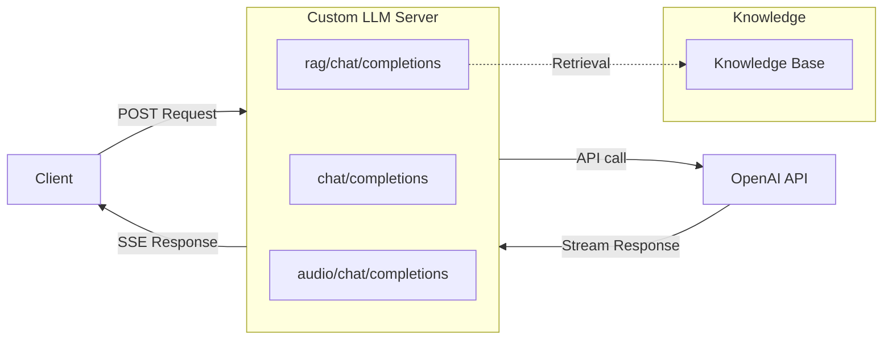

# Custom LLM Server — Go

Go implementation using Gin. Default port: **8102**.

## Quick Start

### Environment Preparation

- Go 1.21+

### Install Dependencies

```bash
go mod tidy
```

### Configuration

Set your LLM API key as an environment variable:

```bash
export YOUR_LLM_API_KEY=sk-...
```

### Run

```bash
go run custom_llm.go
```

The server starts on `http://localhost:8102`.

### Test

```bash
curl -X POST http://localhost:8102/chat/completions \
  -H "Content-Type: application/json" \
  -d '{"messages": [{"role": "user", "content": "Hello, how are you?"}], "stream": true, "model": "gpt-4o-mini"}'
```

Run the automated tests:

```bash
bash ../test/test_go.sh
```

## Architecture



## Endpoints

### `/chat/completions` — Basic LLM Proxy

Forwards chat completion requests to OpenAI with streaming and relays SSE chunks
back.

### `/rag/chat/completions` — RAG-Enhanced

1. Sends a "thinking" message
2. Calls `performRAGRetrieval()` to get context
3. Calls `refactMessages()` to inject the context
4. Forwards augmented messages to OpenAI

Customize `performRAGRetrieval()` and `refactMessages()` with your retrieval
logic.

### `/audio/chat/completions` — Multimodal Audio

Reads `file.txt` for transcript and `file.pcm` for audio data, then streams
them as SSE chunks.

## Expose to the Internet

```bash
cloudflared tunnel --url http://localhost:8102
```

## License

This project is licensed under the MIT License.
