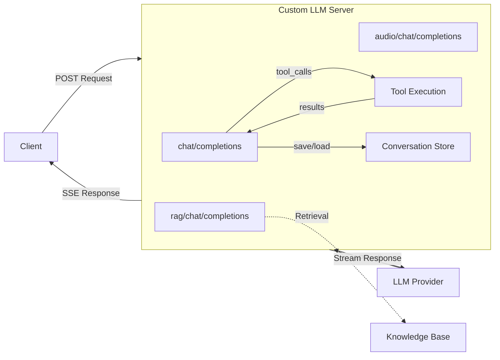

# Custom LLM Server — Go

Go implementation using Gin. Default port: **8102**.

## Quick Start

### Environment Preparation

- Go 1.21+

### Install Dependencies

```bash
go mod tidy
```

### Configuration

Set your LLM API key as an environment variable:

```bash
export LLM_API_KEY=sk-...
```

| Variable | Description | Default |
|----------|-------------|---------|
| `LLM_API_KEY` | API key for LLM provider | _(required)_ |
| `LLM_BASE_URL` | LLM API base URL | `https://api.openai.com/v1` |
| `LLM_MODEL` | Default model name | `gpt-4o-mini` |

Legacy env vars `YOUR_LLM_API_KEY` and `OPENAI_API_KEY` are also accepted.

### Run

```bash
go run .
```

The server starts on `http://localhost:8102`.

### Test

```bash
curl -X POST http://localhost:8102/chat/completions \
  -H "Content-Type: application/json" \
  -d '{"messages": [{"role": "user", "content": "Hello, how are you?"}], "stream": true, "model": "gpt-4o-mini"}'
```

Run the automated tests:

```bash
bash ../test/test_go.sh
```

## Architecture

```
go/
  custom_llm.go           # Main server: endpoints, streaming, tool execution loop
  tools.go                # Tool definitions, RAG data, tool implementations
  conversation_store.go   # In-memory conversation store with trimming
  go.mod / go.sum
```



## Endpoints

### `/chat/completions` — LLM Proxy with Tool Execution

Forwards chat completion requests to the LLM provider. Supports both streaming
(`stream: true`) and non-streaming (`stream: false`) modes.

**Tool execution:** When the LLM returns `tool_calls`, the server executes them
locally and sends the results back to the LLM for a final response. This
multi-pass loop runs up to 5 times.

**Conversation memory:** Messages are stored per `appId:userId:channel` (from
the `context` field) and automatically included in subsequent requests.

### `/rag/chat/completions` — RAG-Enhanced

1. Sends a "thinking" message
2. Retrieves relevant knowledge from the built-in knowledge base
3. Injects the context into the message list
4. Forwards augmented messages to the LLM

### `/audio/chat/completions` — Multimodal Audio

Reads `file.txt` for transcript and `file.pcm` for audio data, then streams
them as SSE chunks.

## Adding Custom Tools

Edit `tools.go`:

1. Add a definition in `GetToolDefinitions()`:
```go
{
    Type: "function",
    Function: ToolFunctionDef{
        Name:        "my_tool",
        Description: "What it does",
        Parameters: map[string]any{
            "type": "object",
            "properties": map[string]any{
                "param1": map[string]any{"type": "string"},
            },
            "required": []string{"param1"},
        },
    },
}
```

2. Implement the handler:
```go
func myTool(appID, userID, channel string, args map[string]any) string {
    param1, _ := args["param1"].(string)
    return fmt.Sprintf("Result for %s", param1)
}
```

3. Register in `ToolMap`:
```go
var ToolMap = map[string]ToolHandler{
    "my_tool": myTool,
}
```

## Conversation Memory

Messages are automatically stored in memory keyed by `appId:userId:channel`.
Pass these values in the request `context` field:

```json
{
  "context": {"appId": "myapp", "userId": "user1", "channel": "ch1"},
  "messages": [{"role": "user", "content": "Hello"}],
  "stream": true
}
```

Conversations are trimmed at 100 messages (keeping 75) and cleaned up after 24
hours of inactivity.

## Expose to the Internet

```bash
cloudflared tunnel --url http://localhost:8102
```

## License

This project is licensed under the MIT License.
