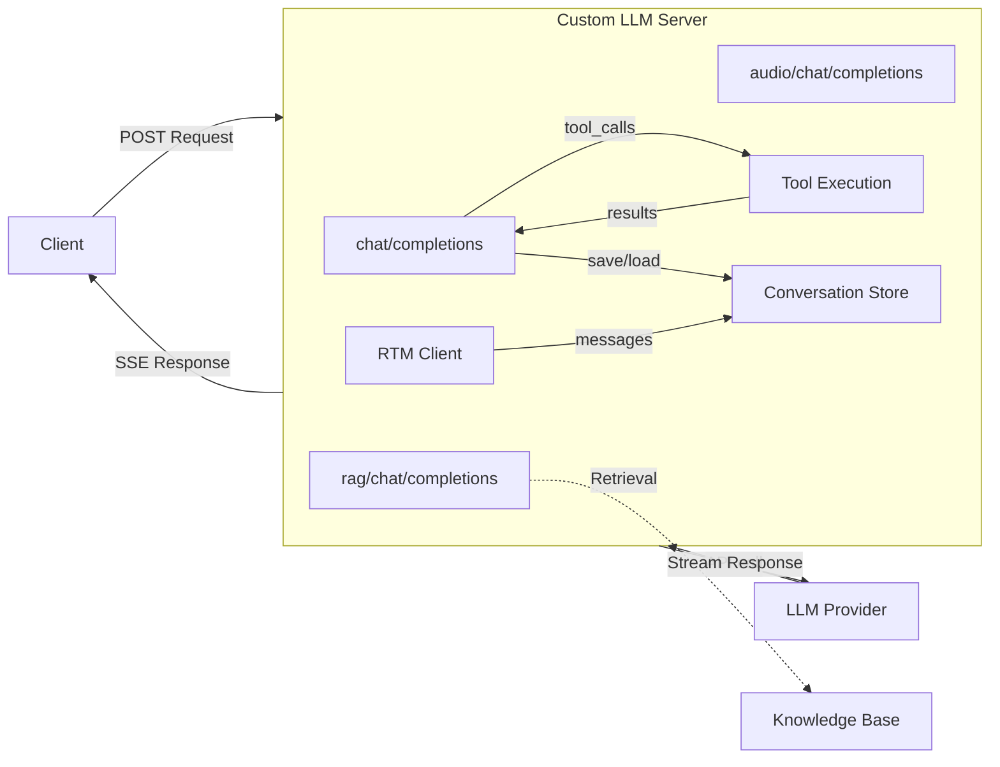

# Custom LLM Server — Node.js

Node.js implementation using Express. Default port: **8101**.

## Quick Start

### Environment Preparation

- Node.js 18+

### Install Dependencies

```bash
npm install
```

### Configuration

Set your LLM API key:

```bash
export LLM_API_KEY=sk-...
```

| Variable | Description | Default |
|----------|-------------|---------|
| `LLM_API_KEY` | API key for LLM provider | _(required)_ |
| `LLM_BASE_URL` | LLM API base URL | `https://api.openai.com/v1` |
| `LLM_MODEL` | Default model name | `gpt-4o-mini` |

Legacy env vars `YOUR_LLM_API_KEY` and `OPENAI_API_KEY` are also accepted.

**RTM (optional):**

| Variable | Description |
|----------|-------------|
| `AGORA_APP_ID` | Agora App ID |
| `AGORA_RTM_TOKEN` | RTM token (optional for testing) |
| `AGORA_RTM_USER_ID` | Agent's RTM user ID |
| `AGORA_RTM_CHANNEL` | RTM channel to subscribe to |

### Run

```bash
npm start
```

For development with auto-restart:

```bash
npm run dev
```

The server starts on `http://localhost:8101`.

### Test

```bash
curl -X POST http://localhost:8101/chat/completions \
  -H "Content-Type: application/json" \
  -d '{"messages": [{"role": "user", "content": "Hello, how are you?"}], "stream": true, "model": "gpt-4o-mini"}'
```

Run the automated tests:

```bash
bash ../test/test_node.sh
```

## Architecture

```
node/
  custom_llm.js           # Main server: endpoints, streaming, tool execution loop
  tools.js                # Tool definitions, RAG data, tool implementations
  conversation_store.js   # In-memory conversation store with trimming
  rtm_client.js           # RTM integration (optional, requires rtm-nodejs)
  package.json
```



## Endpoints

### `/chat/completions` — LLM Proxy with Tool Execution

Forwards chat completion requests to the LLM provider. Supports both streaming
(`stream: true`) and non-streaming (`stream: false`) modes.

**Tool execution:** When the LLM returns `tool_calls`, the server executes them
locally and sends the results back to the LLM for a final response. This
multi-pass loop runs up to 5 times.

**Conversation memory:** Messages are stored per `appId:userId:channel` (from
the `context` field) and automatically included in subsequent requests.

### `/rag/chat/completions` — RAG-Enhanced

1. Sends a "thinking" message
2. Retrieves relevant knowledge from the built-in knowledge base
3. Injects the context into the message list
4. Forwards augmented messages to the LLM

### `/audio/chat/completions` — Multimodal Audio

Reads `file.txt` for transcript and `file.pcm` for audio data. Falls back to
simulated audio if files are not found.

## Adding Custom Tools

Edit `tools.js`:

1. Add a schema to `TOOL_DEFINITIONS`:
```javascript
{
  type: 'function',
  function: {
    name: 'my_tool',
    description: 'What it does',
    parameters: {
      type: 'object',
      properties: { param1: { type: 'string' } },
      required: ['param1'],
    },
  },
}
```

2. Implement the handler:
```javascript
function myTool(appId, userId, channel, args) {
  return `Result for ${args.param1}`;
}
```

3. Register in `TOOL_MAP`:
```javascript
const TOOL_MAP = {
  my_tool: myTool,
};
```

## Conversation Memory

Messages are automatically stored in memory keyed by `appId:userId:channel`.
Pass these values in the request `context` field:

```json
{
  "context": {"appId": "myapp", "userId": "user1", "channel": "ch1"},
  "messages": [{"role": "user", "content": "Hello"}],
  "stream": true
}
```

Conversations are trimmed at 100 messages (keeping 75) and cleaned up after 24
hours of inactivity.

## RTM Integration

The Node.js server optionally connects to Agora RTM for text-based messaging.
Set the `AGORA_*` env vars and install `rtm-nodejs`:

```bash
npm install rtm-nodejs
```

When enabled, the server:
- Subscribes to the configured RTM channel on startup
- Receives text messages from users
- Processes them through the LLM with tool execution
- Sends responses back via RTM

Auto-reconnect with exponential backoff (2s–60s, up to 10 attempts).

## Expose to the Internet

```bash
cloudflared tunnel --url http://localhost:8101
```

## License

This project is licensed under the MIT License.
