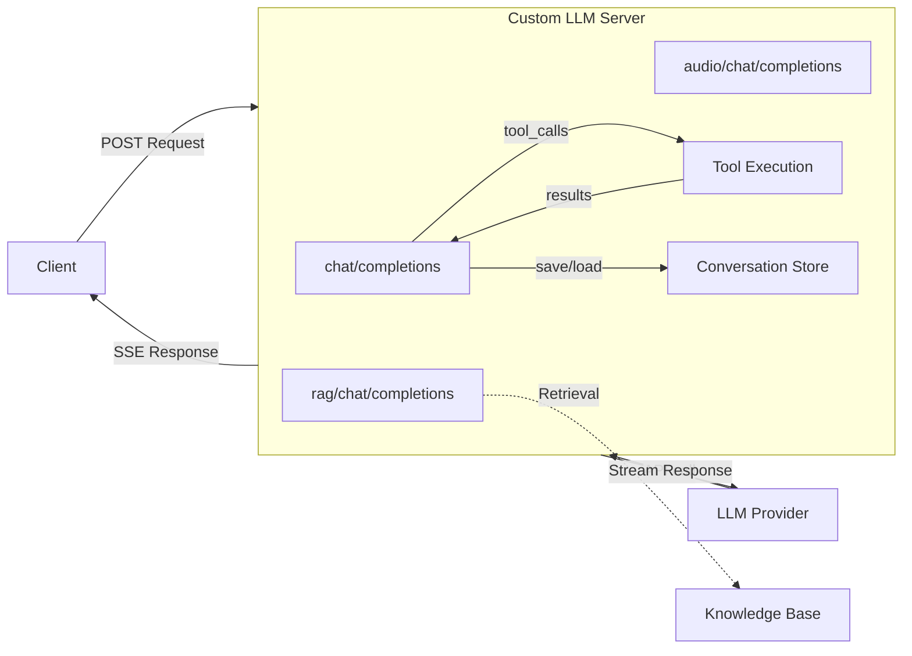

# Custom LLM Server — Python

Python implementation using FastAPI and uvicorn. Default port: **8100**.

## Quick Start

### Environment Preparation

- Python 3.10+

```bash
python3 -m venv venv
source venv/bin/activate
```

### Install Dependencies

```bash
pip install -r requirements.txt
```

### Configuration

Set your LLM API key as an environment variable:

```bash
export LLM_API_KEY=sk-...
```

| Variable | Description | Default |
|----------|-------------|---------|
| `LLM_API_KEY` | API key for LLM provider | _(required)_ |
| `LLM_BASE_URL` | LLM API base URL | `https://api.openai.com/v1` |
| `LLM_MODEL` | Default model name | `gpt-4o-mini` |

Legacy env vars `YOUR_LLM_API_KEY` and `OPENAI_API_KEY` are also accepted.

### Run

```bash
python3 custom_llm.py
```

The server starts on `http://0.0.0.0:8100`.

### Test

```bash
curl -X POST http://localhost:8100/chat/completions \
  -H "Content-Type: application/json" \
  -d '{"messages": [{"role": "user", "content": "Hello, how are you?"}], "stream": true, "model": "gpt-4o-mini"}'
```

Run the automated tests:

```bash
bash ../test/test_python.sh
```

## Architecture

```
python/
  custom_llm.py           # Main server: endpoints, streaming, tool execution loop
  tools.py                # Tool definitions, RAG data, tool implementations
  conversation_store.py   # In-memory conversation store with trimming
  requirements.txt
```



## Endpoints

### `/chat/completions` — LLM Proxy with Tool Execution

Forwards chat completion requests to the LLM provider. Supports both streaming
(`stream: true`) and non-streaming (`stream: false`) modes.

**Tool execution:** When the LLM returns `tool_calls`, the server executes them
locally and sends the results back to the LLM for a final response. This
multi-pass loop runs up to 5 times.

**Conversation memory:** Messages are stored per `appId:userId:channel` (from
the `context` field) and automatically included in subsequent requests.

### `/rag/chat/completions` — RAG-Enhanced

1. Sends a "thinking" message
2. Retrieves relevant knowledge from the built-in knowledge base
3. Injects the context into the message list
4. Forwards augmented messages to the LLM

### `/audio/chat/completions` — Multimodal Audio

Reads `file.txt` for transcript and `file.pcm` for audio data, then streams
them as SSE chunks with transcript and base64-encoded audio.

## Adding Custom Tools

Edit `tools.py`:

1. Add a schema to `TOOL_DEFINITIONS`:
```python
{
    "type": "function",
    "function": {
        "name": "my_tool",
        "description": "What it does",
        "parameters": {
            "type": "object",
            "properties": {"param1": {"type": "string"}},
            "required": ["param1"],
        },
    },
}
```

2. Implement the handler:
```python
def my_tool(app_id, user_id, channel, args):
    return f"Result for {args['param1']}"
```

3. Register in `TOOL_MAP`:
```python
TOOL_MAP["my_tool"] = my_tool
```

## Conversation Memory

Messages are automatically stored in memory keyed by `appId:userId:channel`.
Pass these values in the request `context` field:

```json
{
  "context": {"appId": "myapp", "userId": "user1", "channel": "ch1"},
  "messages": [{"role": "user", "content": "Hello"}],
  "stream": true
}
```

Conversations are trimmed at 100 messages (keeping 75) and cleaned up after 24
hours of inactivity.

## Expose to the Internet

```bash
cloudflared tunnel --url http://localhost:8100
```

## License

This project is licensed under the MIT License.
