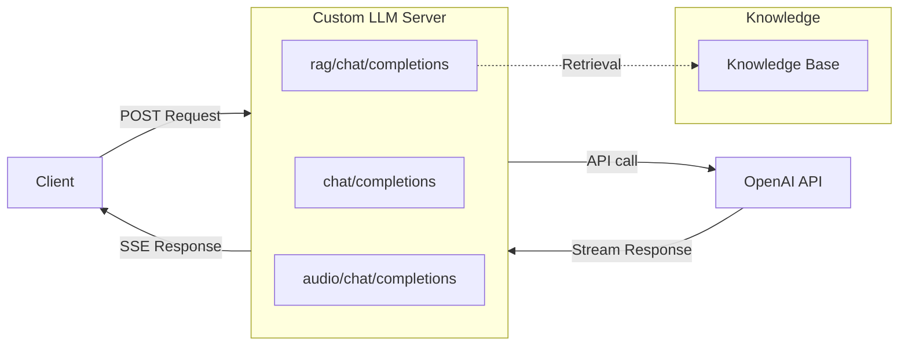

# Custom LLM Server — Python

Python implementation using FastAPI and uvicorn. Default port: **8100**.

## Quick Start

### Environment Preparation

- Python 3.10+

```bash
python3 -m venv venv
source venv/bin/activate
```

### Install Dependencies

```bash
pip install -r requirements.txt
```

### Configuration

Set your LLM API key as an environment variable:

```bash
export YOUR_LLM_API_KEY=sk-...
```

### Run

```bash
python3 custom_llm.py
```

The server starts on `http://0.0.0.0:8100`.

### Test

```bash
curl -X POST http://localhost:8100/chat/completions \
  -H "Content-Type: application/json" \
  -d '{"messages": [{"role": "user", "content": "Hello, how are you?"}], "stream": true, "model": "gpt-4o-mini"}'
```

Run the automated tests:

```bash
bash ../test/test_python.sh
```

## Architecture



## Endpoints

### `/chat/completions` — Basic LLM Proxy

Forwards chat completion requests to the LLM provider with streaming and relays
SSE chunks back.

### `/rag/chat/completions` — RAG-Enhanced

1. Sends a "thinking" message
2. Calls `perform_rag_retrieval()` to get context from your knowledge base
3. Calls `refact_messages()` to inject the context
4. Forwards augmented messages to the LLM

Customize `perform_rag_retrieval()` and `refact_messages()` with your retrieval
logic.

### `/audio/chat/completions` — Multimodal Audio

Reads `file.txt` for transcript and `file.pcm` for audio data, then streams
them as SSE chunks with transcript and base64-encoded audio.

## Expose to the Internet

```bash
cloudflared tunnel --url http://localhost:8100
```

## License

This project is licensed under the MIT License.
